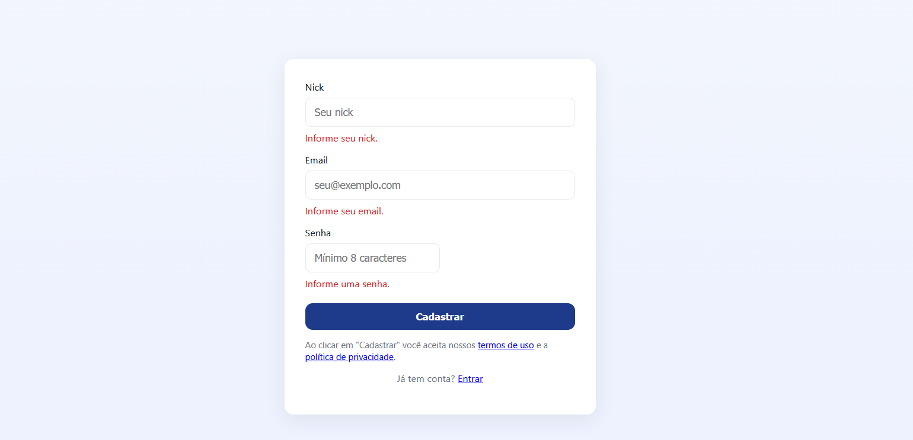

# TELA DE CADASTRO SIMPLES

Descrição
---------
Este projeto é uma página HTML responsiva para cadastro de usuários.
Permite que a pessoa insira Nick, E-mail e Senha, com validação em JavaScript
e exibição de mensagens de erro em tempo real. Possui também um botão
para mostrar ou ocultar a senha.

Principais Recursos
-------------------
- HTML, CSS e JavaScript puro, sem dependências externas.
- Validação dos campos:
  * Nick: mínimo de 3 caracteres.
  * E-mail: formato válido.
  * Senha: mínimo de 8 caracteres.
- Botão de alternância para mostrar ou ocultar a senha.
- Layout responsivo que se adapta a diferentes tamanhos de tela.

Como Executar

-------------
1. Baixe ou clone este repositório.
   Exemplo:
       git clone https://github.com/Helio-Rj/cadastro-usuarios-html-css-js.git
2. Abra o arquivo index.html em qualquer navegador moderno.

Personalização
--------------
- Para enviar os dados para um backend, utilize o trecho comentado no final
  do arquivo e ajuste a rota da sua API.
- Para alterar cores, fontes ou bordas, edite as variáveis CSS no seletor :root.

Estrutura do Projeto
--------------------
index.html   -> Código completo com HTML, CSS e JavaScript integrados.

Licença
-------
Projeto distribuído sob a licença MIT. Você pode usar, modificar e compartilhar
livremente, mantendo a mesma licença.

